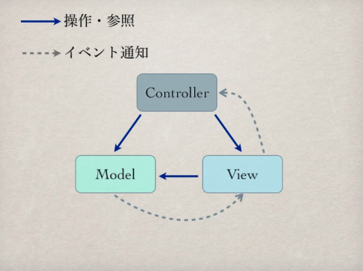
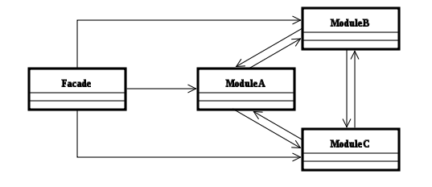

# MVCについて
MVCは、デザインパターンの1種と扱われる場合もあるが（MVCパターンと呼称される）、MVC自体が他の小さなデザインパターン(Observer パターン・Command パターン・Factory Method パターン・Facade パターンなど)を利用して実装されることが多いところからすると、デザインパターンというより、さらに粒度の大きい1種のソフトウェアアーキテクチャという方が適当

wilipedia : https://ja.wikipedia.org/wiki/Model_View_Controller

## コントローラについて
* コントローラが処理するのは、アプリケーションの処理ではない
* コントローラはユーザの操作に基づき、モデルをコントロールする
* これを忘れると、fat-controllerになるで
* ユーザからの入力（通常イベントとして通知される）をモデルへのメッセージへと変換してモデルに伝える要素
* UIからの入力を担当
* モデルに変更を引き起こす場合もあるが、直接に描画を行ったり、モデルの内部データを直接操作したりはしない

## モデルについて
* モデルはアプリケーションの本質そのもの
* GUIでもCLIでも、何でも変わらない処理であればそれはモデルの仕事
* そのアプリケーションが扱う領域のデータと手続き（ビジネスロジック - ショッピングの合計額や送料を計算するなど）を表現する要素

## viewについて
* viewからモデルを参照してもいい
* モデルのデータを取り出してユーザが見るのに適した形で表示する要素
* UIへの出力を担当

## MVCの関連


## MVC + service

### service
* アプリケーションのビジネスルールの担当
* アプリケーションビジネスルール: システムであるが故に発生するビジネスルール
* エンタープライズビジネスルール: システムに関係なく存在している業務上のビジネスルール
* serviceはアプリケーションビジネスルールを担当する
* modelでエンタープライズビジネスルールを実装する


## MVC + cervice + repository
### repository
* serviceから指示を受けて、データベースとのやりとりや外部のapiとのやりとりを担当する

## Facadeパターン
コンピュータソフトウェアのデザインパターンの1つである。Facade（ファサード）とは「建物の正面」を意味する。異なるサブシステムを単純な操作だけを持ったFacadeクラスで結び、サブシステム間の独立性を高める事を目的とする。



```
 import driving.DrivingSimulator;
 public class FacadeTest{
     public static void main(String[] argv){
         new DrivingSimulator().simulate();
     }
 }
```

```
package driving;
 class Car{
     private int speed;
     private int distance;
     Car(){
         this.speed = 0;
         this.distance = 0;
     }
     void setSpeed(int speed){
         this.speed = speed;
     }
     void run(int minutes){
         this.distance += minutes * this.speed;
     }
     int getDistance(){
         return this.distance;
     }
 }
```

```
 package driving;
 class Driver{
     private Car car;
     Driver(Car car){
         this.car = car;
     }
     void pushPedal(int speed){
         this.car.setSpeed(speed);
     }
     void drive(int minutes){
         this.car.run(minutes);
     }
 }
```

```
package driving;
 public class DrivingSimulator{
     public void simulate(){
         Car c    = new Car();
         Driver d = new Driver(c);
         d.pushPedal(700);
         d.drive(30);
         d.pushPedal(750);
         d.drive(20);
         System.out.println("The travel distance is " + c.getDistance() + " m.");
     }
 }
```
